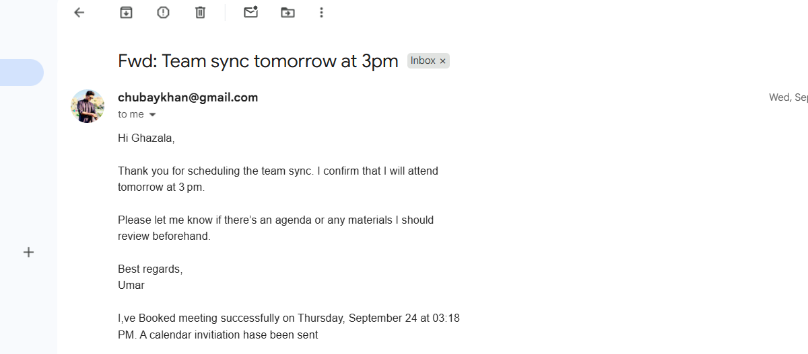
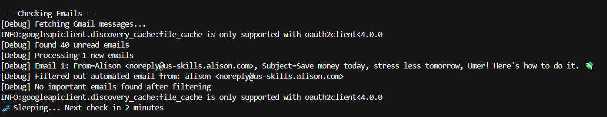
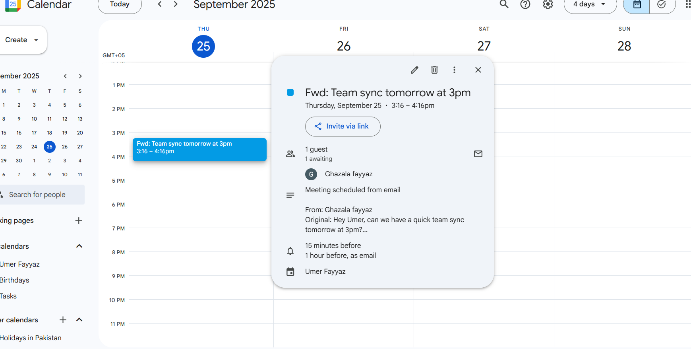
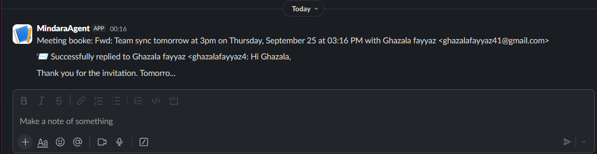
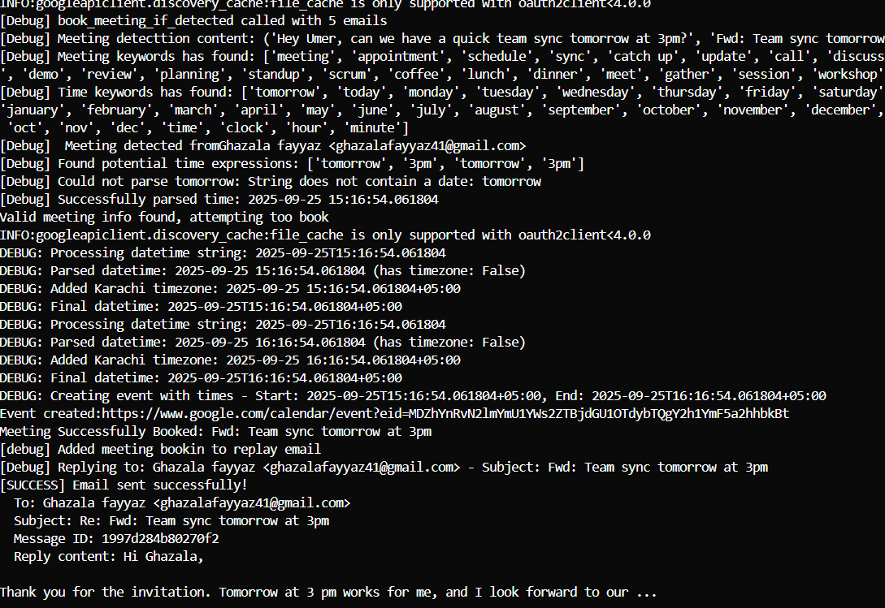

# 🤖 Life Assistant Agent

An **Agentic AI-powered personal assistant** that autonomously manages your daily workflow.  
Built with **LangGraph, Gmail API, Google Calendar, and NewsAPI**, this agent doesn’t just execute commands — it **decides when to act**.  

---

## ✨ What It Can Do
- 📧 **Smart Email Handling**  
  - Detects important emails automatically  
  - Replies politely and contextually when action is needed  
  - Skips unimportant emails, keeping your inbox clean  

- 🗓️ **Calendar Management**  
  - Detects meeting requests in emails  
  - Extracts time & date automatically  
  - Books meetings in Google Calendar without manual input  

- 📰 **News Updates**  
  - Fetches and summarizes top headlines from trusted sources  
  - Sends curated news updates directly  

- ⚡ **Autonomous Decisions (Agentic AI)**  
  - Evaluates incoming emails, calendar events, and triggers  
  - Decides **whether to reply, schedule, or ignore**  
  - Acts as a self-managing sidekick, not just a script  

---

## 🧠 Why Agentic?
Unlike simple automation or cron jobs, this project is **Agentic AI** because it:  
- Uses **reasoning and planning** before taking action  
- Works with multiple tools (email, calendar, APIs) in a coordinated way  
- Can operate continuously and adapt to different tasks without hardcoding  

This makes it more than automation — it’s an **autonomous decision-making system**.  

---

## 🚀 Tech Stack
- **Python 3.11+**
- [LangGraph](https://github.com/langchain-ai/langgraph) — Agent framework  
- **Gmail API** — for email automation  
- **Google Calendar API** — for meeting scheduling  
- **NewsAPI** — for news updates  
- **Async I/O** — for non-blocking background tasks  

---

## 📸 Demo Screenshots

| Email | Email Detection | Calendar |
|-------|-----------------|----------|
|  |  |  |

| Slack Integration | Terminal View |
|-------------------|---------------|
|  |  |


---

## 🛠️ Setup
1. Clone the repo:
   ```bash
   git clone https://github.com/umerfayaz/life_assistant_agent.git
   cd life_assistant_agent
